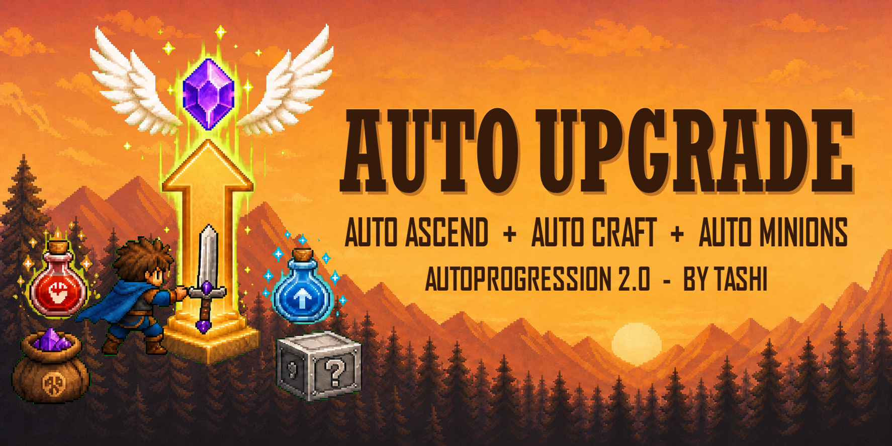

# AutoProgression



AutoProgression automates long-term progression and repeatable account
maintenance in Idle Slayer. It combines purchases, normal Ascension,
craftables, materials, quests, eggs, and paid bonuses behind one global runtime
toggle while keeping individual feature groups configurable.

AutoProgression is part of **Tashi's Full Automation Suite**. It focuses on
account growth and menu-driven maintenance; AutoAdventurer handles active
gameplay and quest objectives, while AutoClimber handles Ascending Heights.

## Documentation

- [User Guide](USER_GUIDE.md)
- [Complete Manual](MANUAL.md)
- [Configuration Reference](docs/08-configuration.md)
- [Troubleshooting](docs/10-troubleshooting.md)

## Features

- Purchases the two 500x Jewels of Soul bonuses and refreshes them from their real cooldown state.
- Claims completed Minion missions, optionally prestiges eligible Minions at their maximum level, and sends affordable missions again.
- Crafts and maintains supported temporary craftables, including Rage Pills, Whetstones, and both temporary staffs.
- Uses Dragon Scale overflow on Random Box Staff, Necklace of Collectables, CpS Compass, and Souls Compass while respecting the shared maximum effect duration.
- Buys missing craftable materials with Jewels of Soul when allowed.
- Crafts Shards Necklaces without a duration cap when Scrap reaches a configurable percentage of its current capacity (97% by default).
- Optionally arms Ascendant Badge Boost whenever its one-use effect is available and Dragon Scales are above 50% of current capacity; disabled by default.
- Optionally opens Dragon Eggs and Simurgh Eggs in the background while preserving configurable reserves.
- Provides a manual Village Casino shortcut for sequential bulk Crawler Eye purchases with Jewels of Soul.
- Purchases available skills and unlocked normal equipment.
- Performs normal Ascension at a configurable soul-bonus threshold and can buy skills afterward.
- Optionally performs Ultra Ascension after native requirements are met and at least 24 Astral Keys are available; disabled by default because this is a major reset.
- Claims completed Daily and Weekly Quests, regenerates exhausted quest sets, keeps rerolls available, and resets the normal Portal cooldown. Periodic automation requires the global `T` toggle; configured vertical-magnet skill blocking remains active independently.
- Uses Specialization for active normal Goblin or Bonus Stage quests and Key Manifest for active normal Chest Hunt quests. Both share a Simurgh Feather threshold; `0` disables both, and crafting must preserve the configured Feather amount. Specialization requires Dragon Scales above 50% and preserves at least 50% Scrap. Daily and Weekly Quests do not trigger these craftables.
- Uses the shared quest-assist Feather threshold as Key Manifest's independent overflow trigger when its native one-use effect is available.
- Dragon Scale-percentage duration items respect the normal maximum-duration setting. Shards Necklace intentionally ignores that cap and consumes Scrap until storage falls below its configured threshold.
- Successful background Weekly Quest rerolls suppress only the trailing native UI exception; genuine reroll failures continue to surface normally.
- Newly generated Daily Quest sets can automatically reroll Goblin, material-collection, temporary-craftable crafting, Chest Hunt, normal or Silver Random Box, normal Boost-use, Rage Mode-use, Bonus Stage entry/full completion/section, Ascending Heights, and Grapple Run objectives. Rage Mode kill and Wind Dash kill quests are retained. Existing quests and manual rerolls do not trigger the filter.

Ultra Ascension is performed only when its explicit warning-marked option is enabled, native requirements are active, and at least 24 Astral Keys are available.

## Controls

- `T` by default: Enable or disable all AutoProgression runtime automation. Change it with `General > Toggle Key`.

Individual features remain controlled by the configuration file. The global toggle does not change saved preferences.

## Configuration

The configuration file is generated at:

```text
ModLoader/UserData/AutoProgression.cfg
```

Settings are grouped into these sections:

- `AutoProgression`: configuration version and debug logging.
- `Ascension`: normal Ascension threshold, optional 24-key Ultra Ascension, and post-Ascension skill purchasing.
- `Paid Bonuses`: paid 500x bonus automation.
- `Minions`: automatic mission claiming/sending and maximum-level prestige.
- `Egg Opening`: master switch plus Dragon Egg and Simurgh Egg reserve amounts.
- `Quests`: claiming, regeneration, rerolls, and Portal cooldown.
- `Craftables`: master switch, supported craftables, durations, thresholds, and Jewel material purchasing.
- Deathwave Scepter uses the shared timed-item refill and target durations, but
  only crafts while Simurgh Feathers remain above its configured reserve.
- `Purchases`: skill and equipment switches plus persistent blocked-skill protection. The latest unlocked equipment is purchased first; older equipment is processed only after the newer item no longer meets its bulk threshold.

> **Currency warning:** `Use Paid 500x Bonuses` directly spends Jewels of Soul. `Buy Missing With Jewels` allows enabled craftable features to spend Jewels of Soul automatically when recipe materials are insufficient. Review these settings before enabling AutoProgression on an unmodified save.

Existing configuration files are migrated when the configuration schema changes.

Normal user logs report initialization, T-toggle state, major progression
actions, manual bulk actions, premium-currency spending, warnings, and errors.
`Debug Mode` is disabled by default and adds aggregated activity summaries,
timing, object-resolution, and state diagnostics with a `[Debug]` prefix.

## Safety and Scope

Automation runs only after the normal gameplay screen has remained stable long enough to be safely operated. Missing or temporarily unavailable game objects are handled without intentionally interrupting the game loop.

Quest automation claims and refreshes quests; it does not travel to dimensions or perform quest objectives.

Character control, quest target selection, Rage coordination, and quest-guided
Portal travel belong to the companion AutoAdventurer mod. Ascending Heights
movement, rewards, and compatible quest enemies belong to AutoClimber.

## Building

Requirements:

- .NET 6 SDK
- Idle Slayer Mod Manager with MelonLoader initialized

From this directory:

```powershell
dotnet build
```

The build creates the DLL and `Publish/Debug/AutoProgression.zip`. It does not deploy automatically unless local deployment is explicitly enabled through the project build property.

## Full Automation Suite

- **AutoAdventurer** handles active gameplay, quest objectives, dimension
  travel, normal automatic jumping, Rage, movement abilities, and boss fights.
- **AutoProgression** handles purchases, normal Ascension, craftables,
  materials, quests, eggs, and repeatable account maintenance.
- **AutoClimber** automates Ascending Heights route planning, recovery,
  rewards, and compatible quest enemies.
- **AutoBonusRunner** automates Bonus Stage routes, jumping, sphere
  requirements, Spirit Boost sections, slider confirmation, and retry.

AutoAdventurer 2.0 replaces Auto Jump for normal gameplay. AutoBonusRunner
replaces Bonus Stage Completer. Each mod can be used independently; together,
the four modules cover complementary parts of a fully automated setup.

## Acknowledgements

The Minion automation behavior was informed by
[MinionSender](https://github.com/Cross-TM/Mods-for-Idle-Slayer/tree/main/MinionSender)
by Cross-TM and
[Enhanced Divinities](https://github.com/Shokram16/Idle_Slayer_Mods/tree/main/Enhanced_Divinities)
by Shokram16. AutoProgression provides an independent implementation integrated
with its runtime toggle, safety guards, and configuration system.

## Support Development

If these mods save you time, you can support continued development through
[PayPal](https://www.paypal.com/donate/?business=HK85PL8AREEXY&no_recurring=0&currency_code=USD).

## Versioning

- Public release version: `2.0.0`
- Internal development revisions are tracked separately in `AutoProgressionInfo.cs`.

## Disclaimer

This is an unofficial community mod. Idle Slayer and its assets belong to their respective owners.
